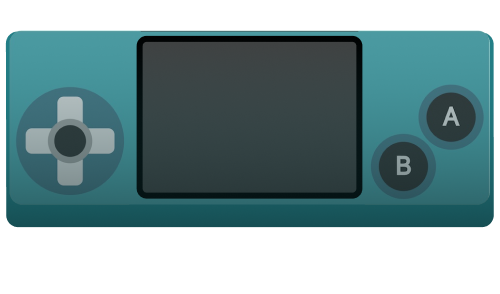

# CMGT Arcade Kast


Hieronder vind je de instructies voor het toevoegen van je game aan de arcade kast:

- Voeg gamepad support toe, zorg dat er geen mouseclicks nodig zijn
- Zorg dat je game in 16:9 of 16:10 verhouding is, zodat de game goed schaalt naar 1440x900 pixels. 
- Zet `fitScreen` aan zodat je game automatisch schaalt.
- Disable de startbutton in het loadingscreen.
- Publiceer je game in de `docs` map op jouw eigen github pages
- Geef de url van je github pages game door aan CMGT.
- Je kan ook je eigen custom image toevoegen.
- Je kan ***Makecode Arcade*** games toevoegen. Je hoeft dan alleen de link naar je game te plakken.

<br>
<br>
<br>

## Gamepad

Je kan de [Excalibur Gamepad](https://excaliburjs.com/docs/gamepad) gebruiken om gebruikersinput te lezen.

GAME.JS - test of gamepad werkt:

```javascript
export class Game extends Engine {

    constructor() {
        super()
        this.start(ResourceLoader).then(() => this.startGame())
    }

    startGame(){
        this.input.gamepads.enabled = true
        this.input.gamepads.on('connect', (connectevent) => {
            console.log('Gamepad connected', connectevent)
            connectevent.gamepad.on('button', (buttonevent) => {
                if (buttonevent.button === Buttons.Face1) {
                    console.log("jump")
                }
            })
            connectevent.gamepad.on('axis', (axisevent) => {
                console.log(axisevent.axis, axisevent.value)
                if (axisevent.value > 0.5) {
                    console.log("move right")
                }
            })
        })
    }
}
```
PLAYER.JS - bewegen met gamepad

In de player is een property voor de gamepad. Als de property gevuld is, dan kan je in de `onPreUpdate` elk frame kijken wat de positie van de sticks is.

```javascript
export class Player extends Actor {

    gamepad = null

    onInitialize(engine) {
        engine.input.gamepads.on('connect', (connectevent) => {
            console.log('Gamepad connected', connectevent)
            this.gamepad = connectevent.gamepad
            this.gamepad.on('button', (buttonevent) => this.buttonPressed(buttonevent))
        })
    }

    buttonPressed(buttonevent) {
        if (buttonevent.button === Buttons.Face1) {
            console.log("shoot!")
        }
    }

    onPreUpdate(engine) {
        if (this.gamepad === null) {
            return
        }
        const speed = 40
        const xValue = this.gamepad.getAxes(Axes.LeftStickX)
        const yValue = this.gamepad.getAxes(Axes.LeftStickY)
        this.vel = new Vector(xValue * speed, yValue * speed)
    }
}
```

<br>
<Br>
<br>

## Startbutton verwijderen

Op de CMGT Arcade kast heb je geen starbutton nodig. 

GAME.JS

```js
export class Game extends Engine {
    constructor(){
        super({
            suppressPlayButton: true
        })
    }
}
```
<br>
<br>
<br>

## Game Size

De monitor in de arcade kast is 1440 x 900. Dit kan je instellen in `game.js`. Door `fitScreen` toe te voegen schaalt de game wel mee met kleinere of grotere schermen.

```typescript
class Game {
    constructor() {
        super({
            displayMode: DisplayMode.FitScreen,
            width: 1440, height: 900,
        });
    }
}
```
Je kan de `draw size` van het `engine` argument gebruiken om items te positioneren:

```js
class Samurai extends Actor {
    onInitalize(engine) {
        this.pos = new Vector(engine.halfDrawWidth, engine.halfDrawHeight)

    }
}
```


<br>
<Br>
<br>

## Game publiceren

Bouw de `docs` folder van je game. Meestal doe je dit met `npm run build`. Op github moet je **github pages** aanzetten, vervolgens kan je `main/docs` kiezen. Je game staat nu live.

<br><br><br>

## Game toevoegen aan arcade kast

Je kan aan een docent vragen om je game toe te voegen aan de arcade kast. We hebben dan onderstaande info nodig:

```json
[
    {
        "name": "Ruimtegruis",
        "url": "https://bpikaar.github.io/ruimtegruis/",
        "players" : 1,
        "cover": "cover_ruimtegruis.png",
        "makecode" : false
    }
]
```
Je kan dit ook zelf doen! Ga dan naar https://hr-cmgt.github.io/arcade-server. Klik op `fork`. Je krijgt nu een kopie van de server. In die kopie kan je jouw game (of games) toevoegen aan de [JSON file](https://hr-cmgt.github.io/arcade-server/data/games.json).

Als dat gelukt is klik je op ***Pull Request***. Als je request is goedgekeurd kan je dit testen op de arcade kast of via:  https://hr-cmgt.github.io/arcade-server/

<br>
<br>
<br>


### Cartridge image


Je kan een eigen cartridge image gebruiken, [gebruik de lege cartridge als basis.](./cart.png) 

<br>
<br>
<br>


<br>
<br>
<br>


# Makecode Arcade

Je kan een link naar je [makecode arcade](https://arcade.makecode.com) game toevoegen aan de arcade kast. Geef de onderstaande info door aan een docent, of maak zelf een pull request (zie instructies hierboven). Zet `makecode` op `true` zodat je de juiste cartridge image krijgt.



```json
{
    "name": "Suzy the Witchy",
    "url": "https://arcade.makecode.com/S05263-10706-41937-72354",
    "players" : 1,
    "cover": "",
    "makecode": true
}
```

<br>
<br>
<br>

## Credits

- Leanne and Bob for building the Arcade Stick Controls for PixiJS (now deprecated).
- [Tim Borowy](https://github.com/TimBorowy) and [GrunkHead Dave](https://github.com/Grunkhead) for the first iteration of the Game Arcade
