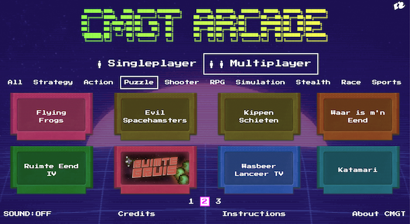
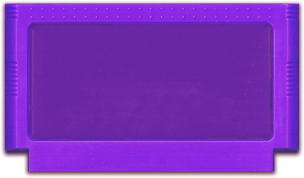

# CMGT Arcade Kast



Hieronder vind je de instructies voor het toevoegen van je game aan de arcade kast:

- Voeg gamepad support toe
- Zorg dat je game in 16:9 verhouding is
- Publiceer je game in de docs map op github pages
- Voeg de url van je github pages game toe aan de JSON file van de arcade kast

<br>
<br>
<br>

## Gamepad

Je kan de [Excalibur Gamepad](https://excaliburjs.com/docs/gamepad) gebruiken om gebruikersinput te lezen.

GAME.JS - test of gamepad werkt:

```javascript
export class Game extends Engine {

    constructor() {
        super()
        this.start(ResourceLoader).then(() => this.startGame())
    }

    startGame(){
        this.input.gamepads.enabled = true
        this.input.gamepads.on('connect', (connectevent) => {
            console.log('Gamepad connected', connectevent)
            connectevent.gamepad.on('button', (buttonevent) => {
                if (buttonevent.button === Buttons.Face1) {
                    console.log("jump")
                }
            })
            connectevent.gamepad.on('axis', (axisevent) => {
                console.log(axisevent.axis, axisevent.value)
                if (axisevent.value > 0.5) {
                    console.log("move right")
                }
            })
        })
    }
}
```
PLAYER.JS - bewegen met gamepad

In de player is een property voor de gamepad. Als de property gevuld is, dan kan je in de `onPreUpdate` elk frame kijken wat de positie van de sticks is.

```javascript
export class Player extends Actor {

    gamepad = null

    onInitialize(engine) {
        engine.input.gamepads.on('connect', (connectevent) => {
            console.log('Gamepad connected', connectevent)
            this.gamepad = connectevent.gamepad
            this.gamepad.on('button', (buttonevent) => this.buttonPressed(buttonevent))
        })
    }

    buttonPressed(buttonevent) {
        if (buttonevent.button === Buttons.Face1) {
            console.log("shoot!")
        }
    }

    onPreUpdate(engine) {
        if (this.gamepad === null) {
            return
        }
        const speed = 40
        const xValue = this.gamepad.getAxes(Axes.LeftStickX)
        const yValue = this.gamepad.getAxes(Axes.LeftStickY)
        this.vel = new Vector(xValue * speed, yValue * speed)
    }
}
```

<br>
<Br>
<br>

## Startbutton verwijderen

Op de CMGT Arcade kast heb je geen starbutton nodig. 

GAME.JS

```js
export class Game extends Engine {
    constructor(){
        super({
            suppressPlayButton: true
        })
    }
}
```

<br>
<Br>
<br>

# Serve your docs folder

Your game needs to be hosted online, you can do this by enabling **github pages**, then build and publish the **docs** folder. 

<br>

## Add game to arcade cabinet JSON

Your game `name` and `url` need to be listed in the [Games JSON file](https://hr-cmgt.github.io/arcade-server/data/games.json). You can make a Pull Request for the arcade server repository, or ask one of the admins to add your game by sending the below information. You can test the arcade cabinet yourself at:  https://hr-cmgt.github.io/arcade-server/

```json
[
    {
        "name": "Ruimtegruis",
        "url": "https://bpikaar.github.io/ruimtegruis/",
        "genres" : [1,1,1,0,0,0,0,0,0],
        "players" : 2,
        "cover": "cover_ruimtegruis.png"
    }
]
```

<br>

### Add cartridge image



If you want, you can photoshop your own cartridge image for display in the server. [Download the base image here](./cart.png) 

<br>
<br>
<br>

## Game Size

The arcade cabinet window is 1440 x 900. You can set your game to this size using: 

```typescript
class Game {
    constructor() {
        // excalibur
        super({ width: 1440, height: 900 })
    
        // pixi
        this.pixi = new PIXI.Application({ width: 1440, height: 900})
    }
}
```

If your game is smaller or bigger, you can scale the canvas using CSS. 

```css
canvas {
    width:100vw;
}
```
If your aspect ratio is not `16:9` you can instead use `height:100vh`.

<br>
<br>
<br>

> Why is half this page in english and half in dutch? we do not know.
 
## Credits

- Leanne, Bob for building the Arcade Stick Controls
- [Tim Borowy](https://github.com/TimBorowy) and [GrunkHead Dave](https://github.com/Grunkhead) for the first iteration of the Game Arcade
